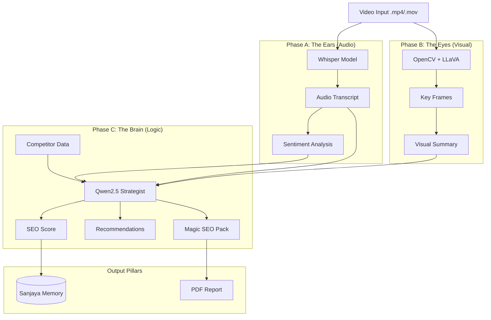

# 🔮 Sanjaya v2.0 - The Content Command Center

**Divya Drishti • Divine Vision**

A production-grade, **100% offline** Video SEO & Strategy tool powered by local AI models. Sanjaya acts as your divine strategist, analyzing your video content through audio, visual, and logical lenses to provide actionable insights, viral predictions, and optimization comparisons.


---

## �️ The 7 Pillars of Sanjaya

Sanjaya v2.0 is built upon 7 powerful pillars to ensure complete content dominance:

### 1. 🛡️ System Health & Batch Queue
Real-time monitoring of your local AI infrastructure (`Ollama`, `LLaVA`, `Qwen`, `Database`). Ensures your "Content Command Center" is always battle-ready.

### 2. 🧠 Sanjaya's Memory (Database)
Never lose an insight. Every analysis is stored in a local SQLite database. Track your progress, view detailed history, and analyze your SEO score trends over time via the **Memory Dashboard**.

### 3. � Sentiment & Virality Detection
Advanced emotional arc analysis using `TextBlob` and `Matplotlib`. Sanjaya detects:
- **Emotional Highs**: Points of maximum engagement.
- **Viral Clip Slicer**: Automatically identifies and slices the most "viral" 30-second segment from your video.

### 4. ⚔️ Competitor Benchmarking (Spy Mode)
Don't just optimize; dominate. Paste a competitor's transcript or description to compare your content directly against theirs. Identify their gaps and your advantages.

### 5. 🖼️ Thumbnail A/B Scorer
Upload multiple thumbnail options. Sanjaya uses **LLaVA (Vision AI)** to rate them based on clickability, text readability, and emotional impact, helping you pick the winner before you publish.

### 6. 📄 Empire-Grade PDF Reports
Generate professional, high-resolution PDF reports (`fpdf2`) of your analysis. Perfect for sending to clients or archiving your strategy.

### 7. 🎯 Advanced Scoring Logic
A strict, production-ready scoring algorithm (0-100) powered by **Qwen2.5**. It penalizes weak hooks (-15 points), missing keywords (-10 points), and rewards perfect execution.

---

## 🏗️ Architecture

Sanjaya operates in three distinct phases of "Divine Vision":



---

## 🔧 Tech Stack

| Component | Technology | Description |
|-----------|------------|-------------|
| **Frontend** | Streamlit | Modern, dark-themed UI |
| **Vision Model** | LLaVA (via Ollama) | Frame analysis & Thumbnail A/B testing |
| **Logic Model** | Qwen2.5 (via Ollama) | Reasoning, scoring, and strategy |
| **Audio Model** | OpenAI Whisper (Local) | High-accuracy speech-to-text |
| **Sentiment** | TextBlob | Emotional arc tracking |
| **Reporting** | FPDF2 | PDF generation |
| **Video Proc** | OpenCV + MoviePy | Frame extraction & clip slicing |

---

## 📋 Prerequisites

### 1. FFmpeg
Required for audio extraction and video processing.

```bash
# Ubuntu/Debian
sudo apt update && sudo apt install ffmpeg

# macOS (Homebrew)
brew install ffmpeg

# Windows (Chocolatey)
choco install ffmpeg
```

### 2. Ollama
Install Ollama to run local AI models.

```bash
# Install Ollama
curl -fsSL https://ollama.ai/install.sh | sh

# Start Service
ollama serve

# Pull Required Models
ollama pull llava
ollama pull qwen2.5
```

---

## 🚀 Installation

1. **Clone the repository**
   ```bash
   git clone <repo-url>
   cd "Video Seo"
   ```

2. **Create a virtual environment**
   ```bash
   python -m venv venv
   source venv/bin/activate  # Linux/Mac
   # or
   venv\Scripts\activate     # Windows
   ```

3. **Install dependencies**
   ```bash
   pip install -r requirements.txt
   ```

---

## ▶️ Usage Guide

1. **Start the App**
   ```bash
   streamlit run app.py
   ```
   *Ensure `ollama serve` is running in the background.*

2. **The Workflow**
   - **Sidebar**: Check system health, enter your **Target Niche/Keyword**, and enable **Competitor Spy Mode** if desired.
   - **Analyze Tab**: Upload your video. Click **"Channel Divine Insights"**.
   - **Review**: Watch the analysis unfold in real-time.
   - **Social Assets**: Go to the **Social Assets** tab to get your "Magic SEO Pack" (Viral Titles, Description, Hashtags).
   - **Memory**: Visit the **Memory** tab to see past analyses and improvements over time.
   - **Export**: Download your **Empire-Grade PDF Report** or the **Viral Clip Slice**.

---

## ⚠️ Troubleshooting

| Issue | Solution |
|-------|----------|
| **Models Offline** | Run `ollama serve` and check `ollama list` to ensure `llava` and `qwen2.5` are present. |
| **FFmpeg Error** | Ensure FFmpeg is in your system PATH. Run `ffmpeg -version`. |
| **Slow Analysis** | LLaVA is resource-intensive. Using a GPU is highly recommended. |
| **Database Lock** | Ensure you don't have the database open in another program (like SQLite Browser) while analyzing. |

---

## 📄 License

This project is open source under the MIT License.

## 🙏 Credits

- **Ollama**: For making local AI accessible.
- **Streamlit**: For the beautiful frontend framework.
- **OpenAI Whisper**: For state-of-the-art transcription.
